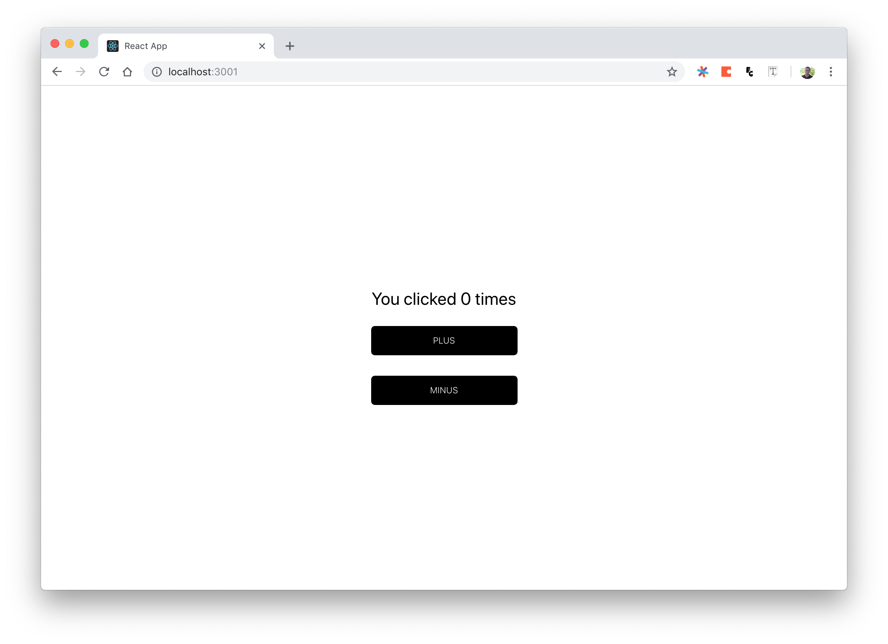

This project was bootstrapped with [Create React App](https://github.com/facebook/create-react-app) and modified to adopt the use of experimental [React Hooks](https://reactjs.org/docs/hooks-overview.html) in `16.7.0-alpha.2`.

### Please note:

- The app does not currently support hot-realoading since it is currently incompatible with React Hooks.
- React Hooks are currently an experimental addition to the React Api. For updated information, refer to the official documentation [here](https://reactjs.org/)

The `App` components uses the `useState` hook to add stateful capability

```javascript
import React, { useState } from "react";

export default () => {
  const [count, setCount] = useState(0);

  return (
    <div className="App">
      <div className="App-header">
        <p>You clicked {count} times</p>
        <button onClick={() => setCount(count + 1)}>plus</button>
        <br />
        <button onClick={() => setCount(count - 1)}>minus</button>
      </div>
    </div>
  );
};
```

with some styles in `index.css` to create the following page



## Usage

In the project directory, you can run:

### `npm install`

To install the dependencies, then

### `npm start`

to run the app in the development mode.<br>
Open [http://localhost:3000](http://localhost:3000) to view it in the browser.
